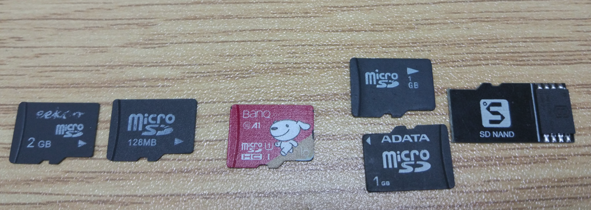

Getting a development board
========

Get your favorite hardware from [Sipeed's official Taobao store](https://shop365481095.taobao.com/) or from [SeeedStudio](https://www.seeedstudio.com/catalogsearch/result/?cat=&q=sipeed)

## Required hardware

### 一A development board

Choose a board [here](../hardware/board.md)

### USB Type C cable

Type-C is chosen because it's reversible and it's very friendly for development.

If you're buying from the official Taobao store, you can ask them to include it with your order. Type-C cables are also very common with Android phones.

### Screen

By default, the LCD (24-pin interface) of the st7789 driver chip is used with a resolution of 320x240.

If you're buying from the official Taobao store, you can ask them to include it with your order.

### Camera

MaixPy devices support the ov2640 camera by default. The ov2640 cameras often bundled with Maix device are typically offered with two different lens options; a smaller fixed-focus lens, or a larger, focusable, fisheye lens.

If you're buying from the Taobao store, you can order a specific camera.

### Micro SD Card (TF Card) (optional)

While some Flash memory within the the device is reserved for a file system, this internal memory is very slow!  For quicker operation and additional storage, people typically insert a `Micro SD` card or a `TF card` into the card slot on most Maix devices.

When purchasing a memory card, choose a new fast Micro SD card, such as a SD 2 generation protocol, Class10 memory card.

Of course, the quality of SD cards on the market is uneven, and the SPI mode may not be compatible. Try to buy a regular card. Or maybe you should customize the driver code ~~

As shown below, the two cards on the left are not supported by the MaixPy driver. Both the middle and the right cards are supported, but the class10 card in the middle is the fastest.

### ST-Link (used to update the firmware of the STM32 on the development board Maix Go) (optional)

If you purchase a `Maix Go`, it has an embedded `STM32` chip to simulate the USB-to-Serial converter, as well as `JTAG`. If you want to upgrade its firmware later on, it is recommended to buy an `ST-Link` programmer.

### JTAG Debugger (optional)

The `K210` chip supports `JTAG` debugging.  If you need to debug, you will need to use the `JTAG` debugger.  They are available from [Sipeed's official Taobao store](https://shop365481095.taobao.com/) or [SeeedStudio](https://www.seeedstudio.com/catalogsearch/result/?cat=&q=sipeed)

If you are using a `Maix Go` development board, you won't need to purchase the `JTAG` debugger separately as it has an integrated `STM32` chip that can emulate `JTAG` (`STM32` uses `CMSIS-DAP` or `open-ec` firmware).  `open-ec` firmware is currently not supported, although support will be added later.  Please refer to the `open-ec` GitHub project page for more information.
